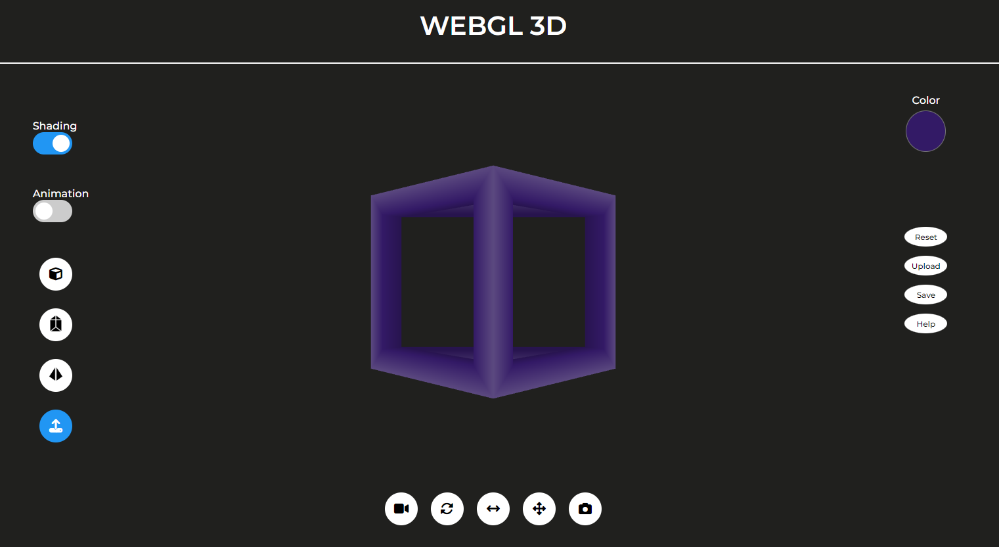

# Tugas 2 IF3260 Grafika Komputer

    
    <h2 align="center">3D Web-GL Hollow Object</h2>

### **Deskripsi Aplikasi**
3D Web-GL ini dapat digunakan untuk melakukan transformasi terhadap *hollow object*. Web ini dibuat dalam rangka memenuhi Tugas 2 IF3260 Grafika Komputer.

### **Pembuat Aplikasi**
| Nama | NIM | 
| --- | --- | 
| Mahesa Lizardy | 13520116 |
| Rania Dwi Fadhilah | 13520142 |
| Mohamad Hilmi Rinaldi| 13520149 |

### **Cara Instalasi**

1. Clone repository ini
2. Buka file index.html yang terdapat pada folder src menggunakan web browser Anda. Pastikan gunakan Web Browser yang support WebGL.
3. Pastikan canvas berhasil ditampilkan pada halaman web dan tidak terdapat pesan error.

### **Cara Penggunaan**
1. Membentuk Model

> Untuk merubah bentuk model yang diinginkan, tekan tombol bergambar <b>Kubus</b>, <b>Prisma Segitiga</b>, atau <b>Piramid</b>.

2. Menyimpan & Mengupload Model

> Untuk menyimpan model yang telah dibuat, tekan tombol <b><i>save</i></b> pada bagian kanan layar dan objek akan tersimpan dengan format <b>json</b>.
> Untuk mengupload model yang telah disimpan, tekan tombol <b><i>upload</i></b> pada bagian kanan layar, lalu pilih file berformat <b>json</b> dan tekan tombol bergambar <b><i>upload</i></b> pada bagian kiri layar untuk melihat model yang telah diload.

3. Memilih Jenis Proyeksi

> Untuk merubah jenis proyeksi yang diinginkan, tekan tombol <b>proyeksi</b> bergambar video kamera pada bagian bawah layar dan memilih jenis proyeksi yang diinginkan diantara <b>Orthographic</b>, <b>Oblique</b>, atau <b>Perspective</b>.

4. Melakukan Rotasi

> Untuk melakukan rotasi pada objek, tekan tombol <b>rotasi</b> bergambar panah berputar pada bagian bawah layar dan menggeser slider pada sumbu rotasi yang ingin diputar.

5. Melakukan *Scaling*

> Untuk melakukan <i>scaling</i> pada objek, tekan tombol <b><i>scaling</i></b> bergambar panah dua arah pada bagian bawah layar dan menggeser slider pada sumbu yang ingin diperbesar/diperkecil.

6. Melakukan Translasi

> Untuk melakukan translasi pada objek, tekan tombol <b>translasi</b> bergambar panah 4 arah pada bagian bawah layar dan menggeser slider pada sumbu yang ingin ditranslasi.

7. Mengubah *Camera View*

> Untuk mengubah <i>camera view</i> pada objek, tekan tombol <b><i>camera view</i></b> bergambar kamera pada bagian bawah layar.
> Geser slider dengan judul <b><i>Angle</i></b> untuk merubah <b><i>angle camera</i></b>.
> Geser slider dengan judul <b><i>Radius</i></b> untuk merubah <b><i>radius camera</i></b>.

8. Mereset *Camera View*

> Untuk mereset <i>camera view</i> pada objek, tekan tombol <b><i>reset camera view</i></b> pada bagian kanan layar.

9.  Mengubah Warna Objek

> Untuk merubah warna objek, tekan tombol <b>warna</b> bergambar <i>color picker</i> pada bagian kanan layar dan memilih warna yang diinginkan.

10. Menggunakan *Shading / Animation*

> Untuk mengaktifkan <i>shading</i> pada objek, tekan tombol <b><i>shading</i></b> pada bagian kiri layar.
> Untuk mengaktifkan <i>animation</i> pada objek, tekan tombol <b><i>animation</i></b> pada bagian kiri layar.
